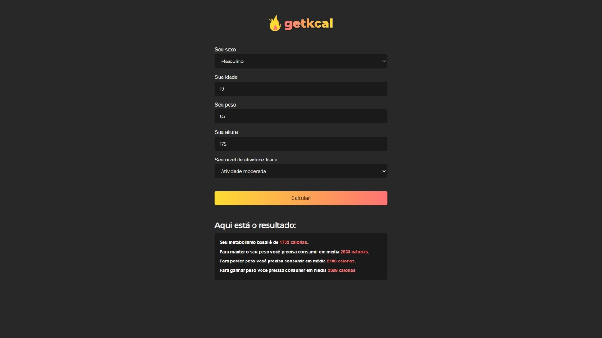

# getkcal

###  A project developed with the purpose of informing the relationship between calories and metabolism taking into account criteria such as weight, age and frequency of physical activities

